**Nama  : Fergie Fatah Ardiansyah  
  Kls   : TI3G  
  NIM   : 2141720211   **

Tugas 1   
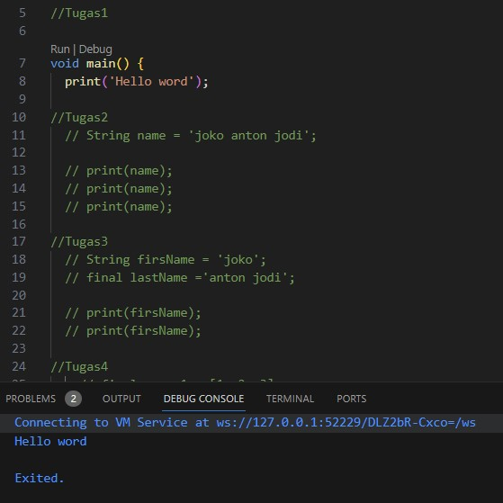 
Output 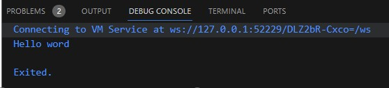
 
Penjelasan: Menampilkan sebuah tulisan Hello Word   
Tugas 2   
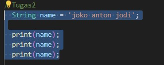 
Output 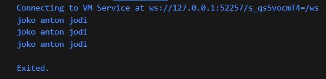
 
Penjelasan: Menampilkan nama lengkap 3 kali berturut   
Tugas 3   
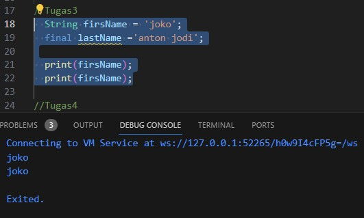 
Output 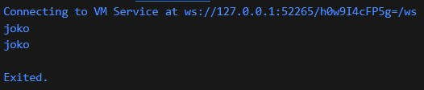
 
Penjelasan: Jadi, kode tersebut digunakan untuk mendeklarasikan dan mencetak dua string, dengan firstName yang dapat diubah nilainya dan lastName yang memiliki nilai tetap (final)   
Tugas 4.1   
.jpg) 
Output  .jpg)
 
Penjelasan: Jika menggunakan code di atas program akan eror dan tidak muncul 
Tugas 4.2   
.jpg) 
Output .jpg)
 
Penjelasan: Jadi, kode tersebut digunakan untuk mendeklarasikan dan mencetak dua jenis variabel numerik, yaitu integer (number1) dan double (number2).  
Tugas 5   
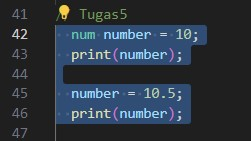 
Output 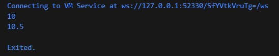
 
Penjelasan: Jadi, kode tersebut menunjukkan fleksibilitas tipe data num dalam Dart yang dapat digunakan untuk menyimpan nilai numerik baik integer maupun double, tergantung pada nilai yang diberikan padanya. Variabel number dalam kode tersebut awalnya adalah integer 10, tetapi kemudian diubah menjadi double 10.5.   
Tugas 6   
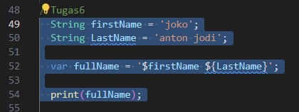 
Output 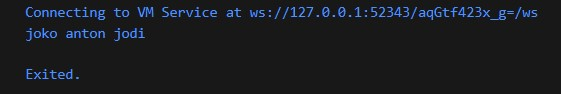
 
Penjelasan: Jadi, kode tersebut digunakan untuk menggabungkan dua string, yaitu FirstName dan LastName, menjadi satu string fullName, yang kemudian dicetak ke konsol.  
Tugas 7   
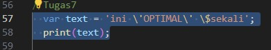 
Output 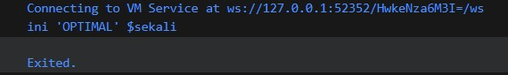
 
Penjelasan: Jadi, kode tersebut digunakan untuk mendemonstrasikan penggunaan karakter escape (\) dalam string Dart untuk menghindari konflik dengan karakter khusus seperti tanda kutip tunggal (') dan tanda dolar ($).  
Tugas 8   
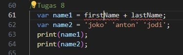 
Output 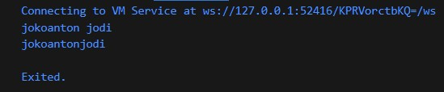
 
Penjelasan: Jadi, dalam kode tersebut, variabel name2 menggabungkan tiga string tanpa operator penggabungan, sedangkan variabel name1 mencoba menggabungkan dua variabel yang sebelumnya belum dideklarasikan.   
Tugas 9   
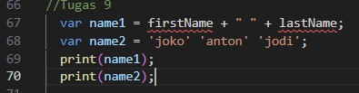 
Output 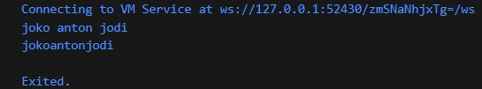
 
Penjelasan: Jadi, dalam kode tersebut, variabel namee1 menggabungkan dua variabel string dengan operator + dan memasukkan spasi di antara keduanya. Sedangkan variabel namee2 menggabungkan tiga string literal tanpa perlu operator +.  
Tugas 10   
 
Output 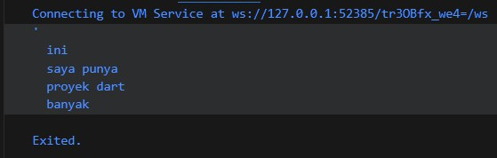
 
Penjelasan: Jadi, kode tersebut digunakan untuk mendemonstrasikan penggunaan tanda kutip tiga (''') untuk membuat string multiline dalam Dart, yang dapat berisi beberapa baris teks tanpa memerlukan karakter escape khusus seperti \n.   
